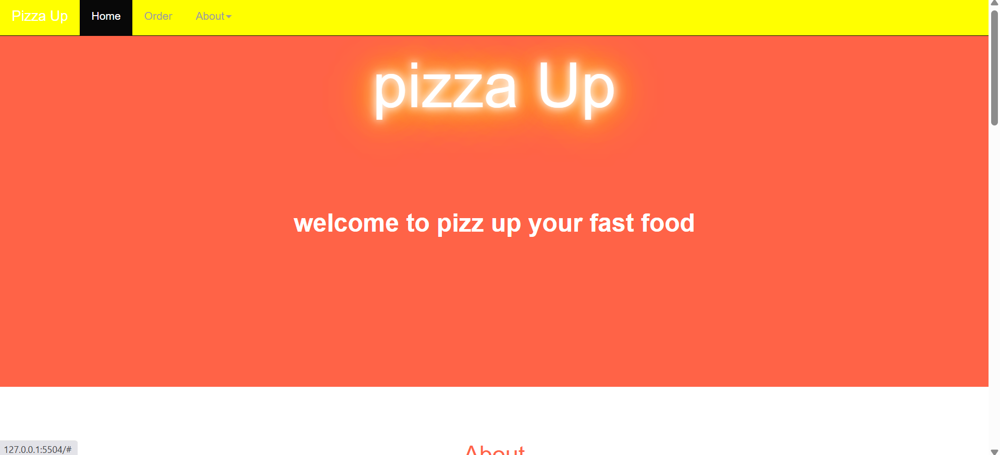

# PIZZA UP

## TECHNOLOGIES USED.
* html
* css
* Javascript
* Boostrap
### FUNCTION OF THIS WEBSITE.
Instead of downlowding an app just to order pizza it is easier to use a website that does not take you through a long process of loging in and  searching for a certain product.
# REASONS FOR CREATING THE APP.
*Save time of going to buy in person. 
*Your eble to place an order at any given time .
*Creating a pizza app also boosts sales when you send the consumer notifications for discounts and special offers ,if you dont have app it will be hard for a consumer to know when there special offers unless they come to the shop physically.
*This also helps to avoid human errors and incress speed.
*After a consure has purchased there order they are able to track there order thus building trust between consumer and seller.
#### DESCRIPTION 
*Choose the size of pizza you want.
*Choose what kind of crust you would like e.g Cripsy,Stuffed,Gluten-free.
*Choose the toppings you want on your Pizza.
*Place an order for your Pizza and see the total charged for it.
*Have an option to order as many pizza as you want.
*Have an option to have the pizza delivered or not.if delivered you will be alerted on how much the delivery cost will be.
*If you want your pizza to be delivered you will be prompted to enter where the delivery should be made and an alert saying "your order will be delivered to your location".
*See a checkout button that when clicked shows the total amount charched for the orders.o help  build trust between consumer and seller

